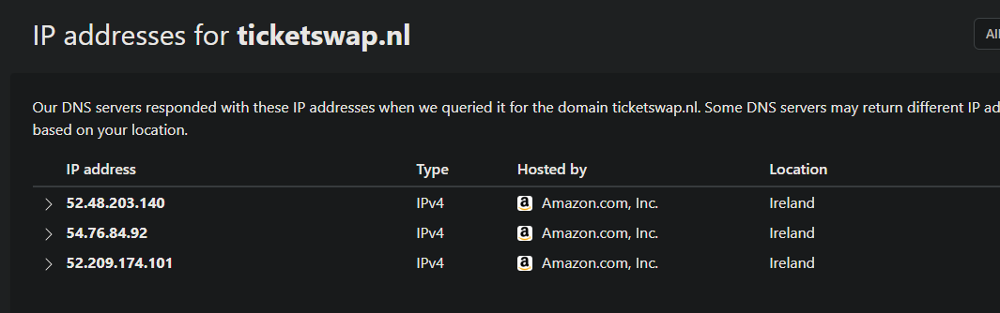

# README

## Install build tools

```sh
sudo apt install cmake clang build-essential gdb libxml2-dev libssl-dev libcurl4-openssl-dev
```

## Very simple profiling

```sh
ts=$(date +%s%N) ; ./ticketswap ; tt=$((($(date +%s%N) - $ts)/1000000)) ; echo "Time taken: $tt milliseconds"
```

Currently about 30ms to query ticket.html and give me the first href attribute on my shitty htpc server:

```sh
sv@m900:/home/sv/ticketswap/build git:(master) $ ts=$(date +%s%N) ; ./ticketswap ; tt=$((($(date +%s%N) - $ts)/1000000)) ; echo "Time taken: $tt milliseconds"
Href: https://www.ticketswap.com/listing/dominator-festival-2023/10042677/3f43b7a78e
Time taken: 28 milliseconds
```

## Serve html

```sh
python3 -m http.server # browse to localhost:8000/ticket.html
```

## Build project

```sh
mkdir build && cd build
cmake -DCMAKE_BUILD_TYPE=Release ..
make -j8
```

## Hosting



Seems ticketswap.nl is hosted in eu-west-1@AWS so might be a good idea to host the servers in that AZ..